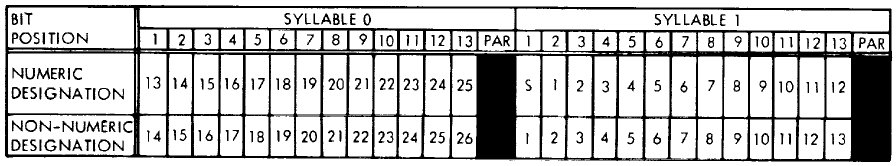
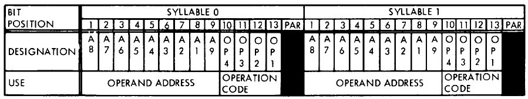

# Launch Vehicle Digital Computer Emulator #

## The LVDC: ##
The Launch Vehicle Digital Computer was a computer system developed by IBM and designed to control the Saturn Rockets between shortly before lift-off and the point where the Apollo Command and Service Module (CSM) sepparated completely from the Launch Vehicle.

The LVDC was located in the Instrument Unit, which sat on top of the Saturn IB's second stage and the Saturn V's third stage.

---

### Architecture ###
The main characteristics of the LVDC are:
 - The computer was triply redundant, with 3 identical computers, running the exact same software. There was a "voting" system, designed to identify and correct errors found during execution;
 - Memory was ferrite-core and entirely RAM. Reading ferrite-core memories destroy the data present in them, so every read operation was followed by a write-back;
 - Memory words were 28-bits long, with 2 bits being used for parity, and each word was divided into 2 syllables (13 bits + 1 parity bit);
 - Each memory word could hold two computer instructions (one in each syllable), but data required a full word;
 - Each memory module was comprised of 4096 words, and the LVDC could be configured with up to 8 modules, for a maximum of 32768 words.
 - There were two independent logic-arithmetic units: one for performing addition, subtraction and logic operations, and the other for permorming multiplication and division operations;
 - Data was 2's complement and integer only.

 ##### source: [The Virtual AGC Project](https://www.ibiblio.org/apollo/LVDC.html#Architecture_of_the_LVDC)

---

## The Emulator: ##
This is a simple emulator written using the [Rust](https://www.rust-lang.org/) programming language. It is not meant to be thorough and complete. It's possible the information here is wrong, or that I interpreted it wrong. Nevertheless, if you have something to add and/or correct, feel free!

---

## The Software: ##
Sadly, there are no surviving (and publicly available) copies of the original software that ran on the LVDC. Because of that, this emulator serves no other purpose other than to entertain my curiosity.

---

## Instruction set: ##
The LVDC had 18 possible instructions:

| Instruction  | OPCODE | Operation |
|:------------:|:------:|-----------|
| HOP          |  000  |  Jump instruction. Address is given by the operand address. |
| MPY          |  0001  |  The contents of the memory location specified by the operand address are multiplied by the accumulator contents. |
| SUB          |  0010  |  Subtract the content of the memory in the operand address from the accumulator, and store the value in the accumulator. |
| DIV          |  0011  |  The contents of the accumulator are divided by the contents of the register specified by the operand address. |
| TNZ          |  0100  |  Analyze the accumulator. Branch if not zero. |
| MPH          |  0101  |  'Multiply and Hold'. Same as MPY instruction, but the result is stored in the accumulator. |
| AND          |  0110  |  Perform bit-by-bit AND operation between the location on the operand address and the accumulator. |
| ADD          |  0111  |  Add the content of the memory in the operand address to the accumulator, and store the value in the accumulator. |
| TRA          |  1000  |  The operand address is transferred to the instruction counter. |
| XOR          |  1001  |  Perform bit-by-bit XOR operation between the location specified by the operand address and the contents of the accumulator. |
| PIO          |  1010  |  The low order address bits A1 and A2 determine whether the operation is an input or output instruction. The high order address bits, A8 and A9 determine whether the data contents are transferred from the main memory, residual memory or accumulator. |
| STO          |  1011  |  The contents of the accumulator are stored in the location specified by the operand address. Content of the accumulator is mainainted. |
| TMI          |  1100  |  Analyze the minus accumulator sign. Branch if negative (zero is considered positive). |
| SHF          |  1110  |  Shifts the accumulator right or left one or two places, specified by the operand address. |
| CLA          |  1111  |  Transfer the contents of the location on the operand address to the accumulator. |

I tried my best to implement the instructions in the most precise way, as they are described by the official documentation.

---

## Registers: ##

The main registers, and the ones implemented here are:
- The accumulator register;
- The Product-Quotient register (or simply P-Q register);
- The HOP register;

The LVDC had multiple hidden registers not relevant to software, which are not discussed or implemented in this project.

---

## Memory Layout: ##
As discussed previously, memory in the LVDC was comprised of 28-bit long words, divided in two 14-bit syllables, each with 13 bits of data plus one parity bit.

## Data memory: ###

The figure shown below illustrates how data is organized in a memory word. For numeric data, there is a sign bit (S), and the bits are, from most-significant to least-significant, ordered 1 through 25. For non-numeric data, there is no sign bit and the data is stored in 26 bits.

---
### Instruction Memory: ###

The instructions are stored in memory following the structure depicted in the figure below, with 4 bits representing the opcodes, and the remaining 9 bits pointing to the operand address in memory.

You might have noticed that the 'operand address' bits are not stored sequentially. From most to least-significant, they are A8 to A1, and lastly A9.

The memory available to the LVDC was divided into 256-word sectors. bits A1 to A8 selected an offset into a sector, and bit A9 (also referred to as the "residual bit") selects which sector is being addressed. When A9 is zero, the current sector is being addressed, and when it is one, the instruction is addressing the "residual sector", which is always sector 017(octal).

The residual sector is only used for addressing memory, and there's no way to address instructions in it, unless when the currently-selected sector _is_ the residual sector. In a nutshell, the residual sector is good for storing global variables, while the currently-selected sector is good for local-variable storing.

#### source: [The Virtual AGC Project](https://www.ibiblio.org/apollo/LVDC.html#Layout_of_Memory_Words)

---

# References #
1. [The Virtual AGC Project - Launch Vehicle Digital Computer](https://www.ibiblio.org/apollo/LVDC.html#What_is_the_Launch_Vehicle_Digital_);
2. [Saturn Launch Vehicles TR X-881](https://web.archive.org/web/20050416215829/https://ntrs.nasa.gov/archive/nasa/casi.ntrs.nasa.gov/19710065502_1971065502.pdf), pages 20-101 and 20.102 for the instruction set;
